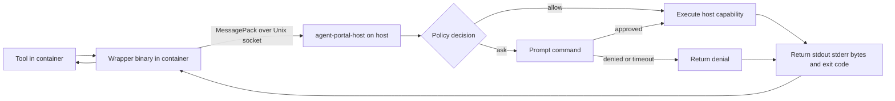

# Portal and Agent-box relationship

Portal and Agent-box are complementary, not coupled.

## Independent concerns

- Agent-box: workspace + container lifecycle orchestration
- Portal: host capability mediation with policy/prompt/audit boundary

## Combined flow

When used together:

1. Agent-box starts container and mounts portal socket.
2. Agent-box sets `AGENT_PORTAL_SOCKET` in container env.
3. Wrapper/tool in container calls portal client.
4. Portal host enforces policy and executes host operation.

### Request flow diagram

*Use scroll/pinch to zoom, drag to pan (Excalidraw interactive viewer).*

## Why keep them separable

- Portal can serve non-Agent-box environments.
- Agent-box remains useful without Portal methods.
- Integration boundary stays explicit (socket + env), reducing hidden coupling.
